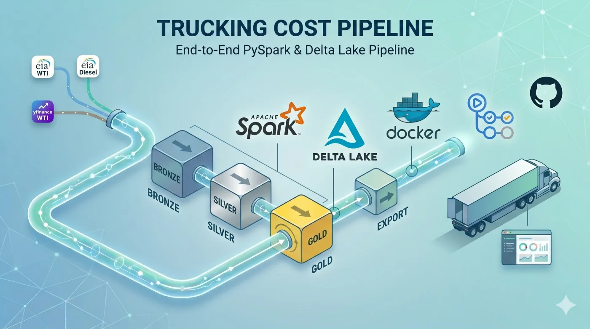
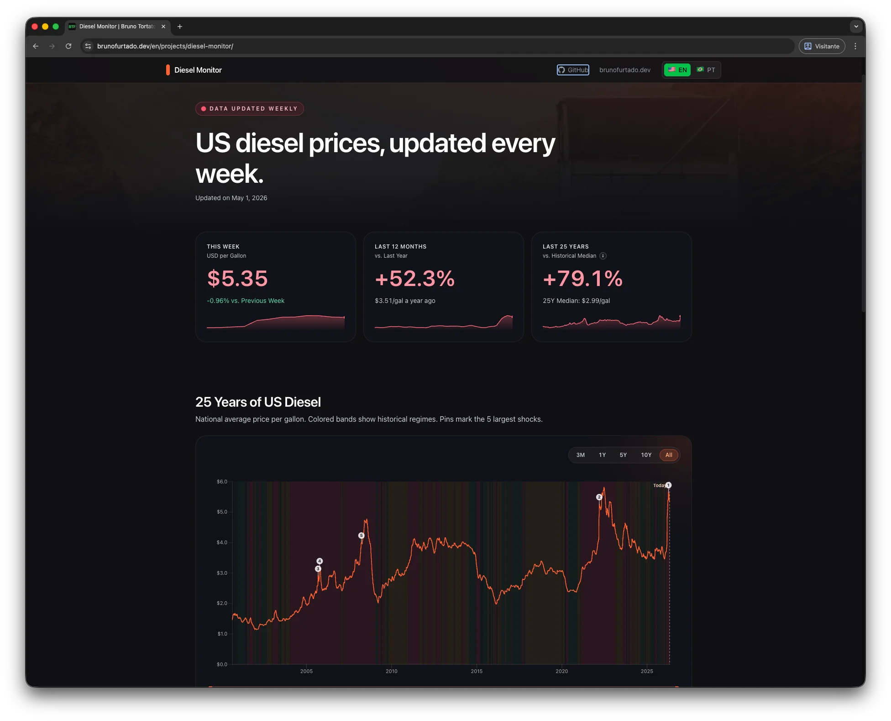
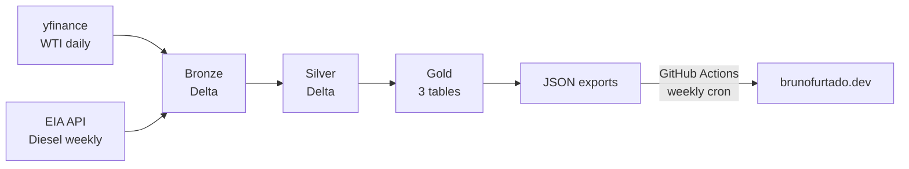

<div align="center">

  

      


</div>

<br/>

PySpark + Delta Lake pipeline that ingests 25 years of WTI and US diesel prices, models their lag, and ranks the largest historical fuel shocks.

---

## Why this exists

Diesel is the single largest variable cost for US trucking carriers. Retail diesel prices follow WTI crude with a delay, but the exact lag and the magnitude of pass-through are not constants. This pipeline answers three concrete questions: how have the two prices moved together over 25 years, how many days does diesel lag WTI, and which historical events produced the largest 4-week price shocks.

## Live demo

Live dashboard at **[brunofurtado.dev/projects/diesel-monitor](https://brunofurtado.dev/projects/diesel-monitor)**, refreshed weekly by this pipeline.

[](https://brunofurtado.dev/projects/diesel-monitor)

## What it shows

**Price timeline.** Daily WTI (yfinance) joined to weekly retail diesel (EIA), forward-filled to a daily grid covering 25 years. Output is a single tidy table consumed by a dual-axis chart.

**Lag analysis.** Cross-correlation between WTI and diesel returns across a sweep of lag values. The peak sits at 11 days, which matches the known refinery-to-pump pass-through window.

**Fuel shocks ranking.** Top 10 historical 4-week percent changes in diesel price, with non-maximum suppression so a single multi-week event does not dominate the list.

## Architecture



## Tech stack

| Layer | Technology | Why |
|---|---|---|
| Compute | Apache Spark 4.1 (PySpark) | Distributed processing primitives, window functions, schema enforcement |
| Storage | Delta Lake 4.2 | ACID, time travel, idempotent writes via `replaceWhere` |
| Orchestration | Docker Compose (local) + GitHub Actions (prod) | Reproducible local dev, free public CI with logs as proof of production |
| Tests | pytest | Pure-logic tests in seconds, no I/O, no Delta in tests |
| Data sources | yfinance + EIA Open Data API v2 | Free public sources, no API limits at this volume |
| Serving | Static JSON via Firebase Hosting CDN | Zero infrastructure cost, low latency, weekly refresh sufficient |

## Pipeline design decisions

### Medallion architecture (bronze / silver / gold)
Separates raw retention from business-ready aggregates. Bronze keeps source-of-truth with audit metadata (`ingestion_date` partitions); silver enforces schema and dedups; gold is shaped per analytical question, optimized for read.

### Delta Lake over plain Parquet
Idempotent overwrites via `replaceWhere(ingestion_date = '...')`. Time travel debugs upstream changes. ACID on flat storage matters when the pipeline runs unattended.

### Rolling 28-day window for shock detection
Single-week pct_change is dominated by noise (5-8% weekly oscillation is normal). 4-week windows filter noise while still being responsive. Trade-off: slower to detect shocks vs higher signal-to-noise ratio.

### Non-maximum suppression with tiebreaker (the bug worth documenting)
First implementation used `pct_change == local_max` to find peaks within ±14 days. This worked on synthetic data but broke on production: forward-filled weekly diesel prices produce identical pct_change values across consecutive days, so a single event filled the top of the rankings (4 of top 5 were the same Q1 2026 spike).

Fix: after the local_max filter, partition by `pct_change_28d` and keep `row_number = 1`, deduplicating clusters of identical values to one date per event. Regression test in `tests/test_gold_fuel_shocks.py::test_handles_tied_pct_change`.

### Static JSON over live API
Data refreshes weekly. A live API would add cold-start latency, runtime cost, and infrastructure complexity for zero benefit. Static JSON served by CDN gives <50ms p99 latency at zero cost.

### GitHub Actions over managed orchestrators (Airflow, Prefect, Cloud Composer)
Free for public repos, logs are public (acts as proof-of-production for portfolio), weekly cadence does not need a scheduler with retry semantics. Trade-off accepted: no DAG visualization, no backfills.

## Project structure

```
trucking-cost-pipeline/
├── pipeline/
│   ├── bronze.py        # Raw ingestion (yfinance + EIA API)
│   ├── silver.py        # Dedup, schema enforcement
│   ├── gold.py          # 3 analytical tables
│   ├── export.py        # JSON serialization
│   ├── config.py        # DATA_ROOT-aware paths
│   └── sources/         # API clients
├── tests/               # 11 pytest cases (gold logic + manifest format)
├── .github/workflows/
│   └── pipeline.yml     # Weekly cron + cross-repo deploy
├── Dockerfile
├── docker-compose.yml
└── pyproject.toml
```

## Running locally

```bash
# 1. Set EIA API key (free at https://www.eia.gov/opendata/register.php)
echo "EIA_API_KEY=your_key" > .env

# 2. Build container
docker compose build

# 3. Run pipeline (full)
docker compose run --rm pipeline python -m pipeline.bronze
docker compose run --rm pipeline python -m pipeline.silver
docker compose run --rm pipeline python -m pipeline.gold
docker compose run --rm pipeline python -m pipeline.export

# Or run tests only
docker compose run --rm pipeline pytest tests/ -v
```

Outputs land in `./data/` (bind-mounted to `/data` inside the container). Final JSONs in `./data/exports/`.

## Tests & CI

11 pytest cases covering:
- Gold layer logic (forward-fill, lag detection, NMS with tiebreaker)
- JSON manifest format

GitHub Actions runs every Tuesday 15:00 UTC:
1. pytest gate (fails fast if logic regressed)
2. Full pipeline (bronze → silver → gold → export)
3. Output validation (file existence, sizes, JSON parseability)
4. Data freshness check (`data_through` must be ≤7 days old)
5. Cross-repo push to consumer site (only if data changed)

## Data sources

- WTI Crude Oil daily prices: Yahoo Finance via the `yfinance` Python library
- US On-Highway No. 2 Diesel weekly retail prices: EIA Open Data API v2

This project is for educational and portfolio purposes. Data is subject to source providers' terms.

## License

This project is licensed under the [MIT License](./LICENSE).

---

<div align="center">
  <sub>Made with ♥ in Curitiba 🌲 ☔️</sub>
</div>
